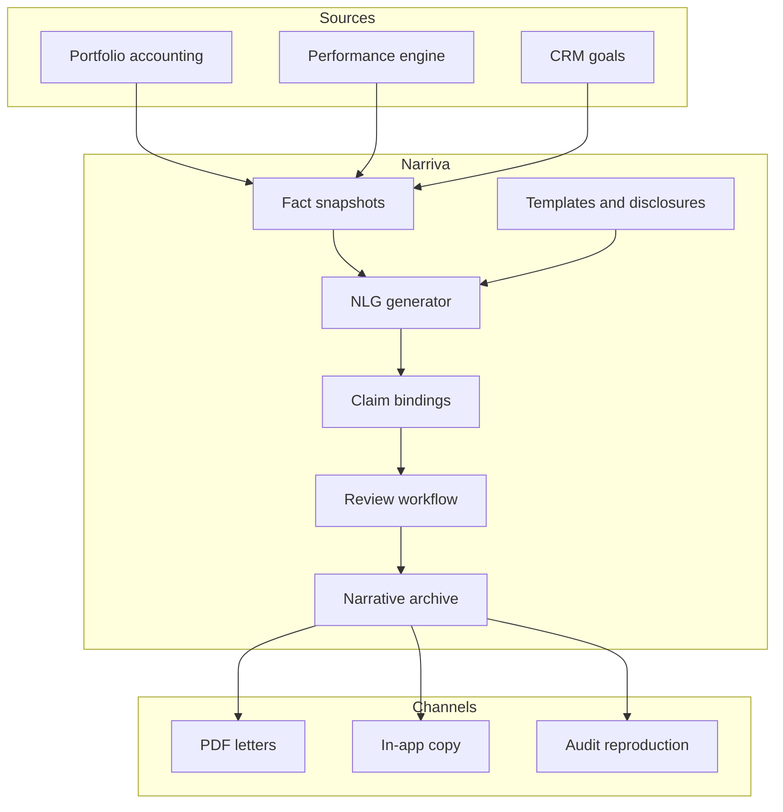

# Narriva

**Source:** `ai-in-financial/Narrative-Science-The-Rise-of-ai-in-financial-Services/`
**Domain:** `ai-fin`
**One-liner:** An enterprise natural-language generation system that turns portfolio, fund, and account data into regulated, audience-specific client narratives—so wealth and asset managers stop shipping spreadsheets where clients need explanations.
**Wedge:** Asset managers and wealth platforms producing monthly/quarterly client reviews, fund commentaries, and goal-progress letters at scale under compliance review.
**Positioning:** Narrative generation for client reporting. Narrative Science’s 2016 brief shows only 32% of surveyed FS firms used AI, cites personalising communications at scale as a primary reason among adopters, and highlights USAA-style portfolio write-ups and American Century fund-commentary automation—while regulators reject black boxes. Narriva is the explainable NLG control plane for client-facing words, not a chatbot or robo-allocator.

## Market research synthesis

### Thesis from source

The research brief (NBRI survey of 112 FS executives, Apr–May 2016, ~87% confidence / 5% sampling error) finds traditional firms early in AI adoption: 32% using predictive analytics, recommendation engines, or voice; 12% holding back because AI feels too new, untested, or insecure; only 6% with a dedicated innovation leader. IDC is cited forecasting cognitive systems revenues from ~$8B (2016) to >$47B (2020), with banking among the top two industries.

Challenges centre on siloed data, talent shortage, weak data governance, and regulatory intolerance of unexplainable systems. Stanford’s AI100 framing is quoted: systems must explain decisions to build trust. Benefits clusters include personalised communications (robo-advisors; USAA NLG portfolio narratives; American Century fund commentaries), productivity automation (13% of respondents), fraud (Feedzai challenger models; ThetaRay at ING for SME lending fraud), consumer spending advice (Moven, Simple), and conversational interfaces (with NLG as the substrate that “knows what it is talking about”).

The differentiating product is not “AI in FS.” It is the NLG reporting factory: map structured holdings and performance data to meaning, generate perfectly audience-tuned narratives at unlimited scale, keep humans on high-value commentary, and retain auditability of what was said to whom—addressing the transparency gap the brief says ML alone will not solve.

### Buyer & economic model

- **Primary buyer:** Head of Client Reporting / Head of Digital Wealth Experience, or COO of an asset-management distribution unit.
- **Users:** client-reporting analysts, portfolio managers (reviewers), compliance marketing reviewers, data stewards, digital channel owners.
- **Budget owner / value metric:** client-reporting ops cost and advice-quality budget. Value metric is cost per compliant narrative and reduction in manual writing hours for routine commentaries.
- **Competing status quo:** Excel + Word mail merge; offshore writing teams; generic PDF factsheets; chatbots that cannot cite portfolio facts reliably.

### Domain constraints

- **Regulatory / trust / safety:** marketing and performance presentation rules; suitability of language; record-keeping of client communications; no hallucinated holdings or returns.
- **Data sensitivity:** account-level positions and performance are confidential; generation must be tenant-isolated.
- **Change-management realities:** PMs will not trust fully unattended commentary; Narriva needs review workflows and locked fact tables.

## Business requirements

- BR-1: Every narrative must be generated from a locked fact snapshot (holdings, returns, benchmarks, goals)—no free-form invention of numbers.
- BR-2: Templates must be audience-specific (retail client, advisor, institutional consultant) with tone and disclosure rules per audience.
- BR-3: Compliance must pre-approve template libraries and block unapproved claims language.
- BR-4: Human review gates must be configurable by product risk; routine goal-progress letters may auto-send, fund commentaries may require PM sign-off.
- BR-5: Each sentence-level numeric claim must be traceable to a fact field for audit.
- BR-6: Multi-language generation must preserve the same fact binding across locales.
- BR-7: Versioned narratives must be retained as the communication record of what the client received.
- BR-8: Data silos must be queryable via governed connectors; generation fails closed if required facts are missing—never invents.
- BR-9: Productivity reporting must show analyst hours saved without counting rejected drafts as success.
- BR-10: Regulators or internal audit must be able to reproduce a narrative from the same fact snapshot and template version.
- BR-11: Black-box model explanations are insufficient: the system must expose the template logic and fact bindings, not only a confidence score.
- BR-12: Narriva must not execute trades or rebalance—reporting and explanation only (no overlap with Autara or Veltara execution/advice gates).

## User stories

Canonical user stories live in sibling [USER_STORIES.md](USER_STORIES.md).

## System design

### Overview

Narriva ingests governed fact snapshots, selects audience templates, generates narratives with claim-to-fact bindings, routes through optional human review, delivers to channels, and archives the exact artefact. Compliance owns template policy; data stewards own fact authority; PMs/analysts own judgment overlays.

### Actors & boundaries

- **Actors:** reporting analyst, PM, compliance, data steward, channel owner, end client (recipient).
- **Trust boundary:** fact stores remain in firm systems; Narriva holds snapshots, templates, and generated artefacts under firm tenancy.
- **Human-in-the-loop points:** template approval; optional narrative approval; complaint-driven regeneration review.

### Core capabilities

1. **Fact snapshot service** — locked, attributable inputs.
2. **Template and disclosure library** — audience and product rules.
3. **NLG generation with claim bindings**.
4. **Review and approval workflow**.
5. **Multi-channel delivery hooks**.
6. **Narrative archive and reproduction**.
7. **Missing-fact fail-closed controls**.
8. **Productivity and quality analytics**.

### Conceptual data

- **Primary entities:** FactSnapshot, FactField, Template, DisclosureRule, NarrativeDraft, ClaimBinding, Approval, DeliveredNarrative, ReproductionJob.
- **Critical events:** snapshot locked, draft generated, claim bound, approved/rejected, delivered, reproduced for audit.
- **Retention / audit needs:** delivered narratives and snapshots retained for client-communication statutory periods; drafts retained per firm policy.

### Integrations (conceptual)

- **Systems of record:** portfolio accounting, performance engines, CRM, document management.
- **Upstream signals:** corporate actions, benchmark services, goal systems.
- **Downstream actions:** email/PDF/app delivery, complaint systems, marketing archives.

### High-level architecture

### Success metrics

- **Leading:** % narratives auto-generated with zero missing facts; median review time; template approval coverage; claim-binding coverage rate.
- **Lagging:** cost per client letter; analyst hours on routine commentary; communication-related complaints; audit exceptions on unverifiable claims.

## OpenAPI

Canonical HTTP surface lives under `packages/openapi-core/src/` (one YAML per domain). Summary:

- **Base path:** `/v0/tenants/me/...` (scaffold tenant pattern)
- **Auth:** `X-API-Key` for tenant APIs; Bearer JWT for operators (`/v0/auth/*`)
- **Domains:** identity, snapshots, templates, narratives, approvals, deliveries, reproductions

