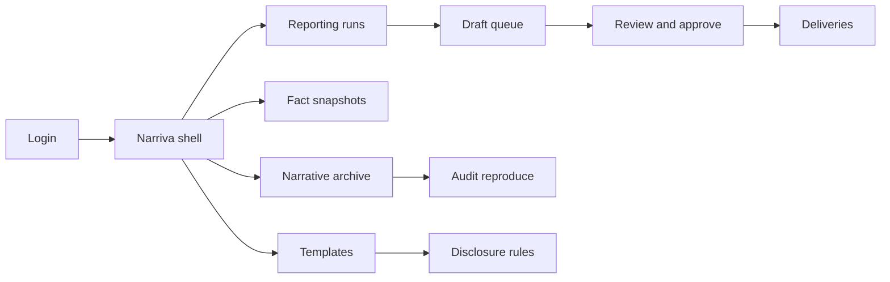
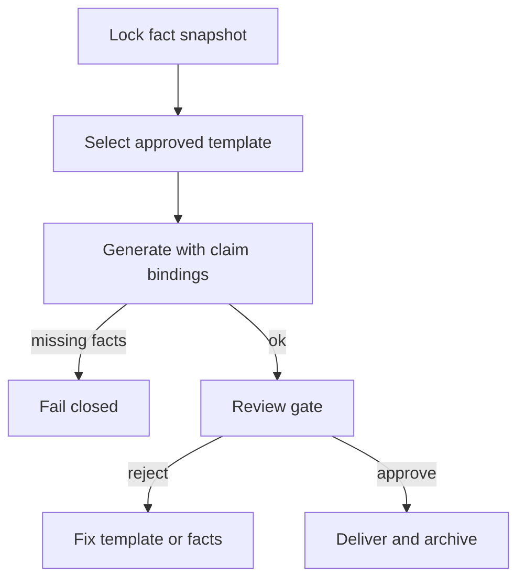

# Narriva — Web app

**Product:** [PRODUCT.md](./PRODUCT.md)
**Primary surface:** Client-reporting NLG console (analyst / PM / compliance / data steward workspaces)
**Secondary surfaces:** Client-facing delivery preview (read-only channel render); audit reproduction viewer
**Design thesis:** Narriva is a regulated newsroom for portfolio truth — the UI metaphor is a locked fact desk and claim-cited galley proof, not a chatbot playground. Visual language is ink-black type on warm newsprint panels with signal-blue citation underlines: numbers feel sourced; unapproved claims feel redlined; missing facts fail closed as a stop-press banner. The Narriva wordmark sits as a quiet masthead on every draft and archive screen so reviewers know whose communication record they are signing.

## UX research synthesis

### Category peers (best-in-class)

- **Arria NLG / Narrative Science Quill-era reporting UIs:** Structured data → narrative with template control for finance commentaries. Steal: audience templates and batch letter runs; reject opaque “AI wrote this” without fact bindings.
- **Broadridge / SS&C client reporting portals:** Period packs, household letters, and compliance archives at wealth scale. Steal: period batch operations and delivery status; reject spreadsheet-export-as-UX for the narrative itself.
- **Google Docs / Word suggestion + track-changes (review pattern):** Inline review, reject-with-reason, version history. Steal: PM judgment overlays on drafts without rewriting tables; reject free-form editing that breaks claim bindings.
- **Compliance marketing review tools (e.g. Global Relay / archive-centric patterns):** Exact artefact retention of what was sent. Steal: immutable delivered record and reproduction; reject confidence-score-only “explainability.”

### Patterns to adopt / reject

- **Adopt:** Locked fact snapshot before generate; sentence-level claim-to-fact underlines; audience + disclosure libraries owned by compliance; configurable human gates by product risk; fail-closed missing facts; multi-locale same bindings; reproduce-from-snapshot for audit; productivity that excludes rejected drafts.
- **Reject:** Chat composer as primary UX; hallucinated “helpful” numbers; purple AI rewrite panels; editable delivered artefacts; trading/rebalance actions (BR-12); black-box confidence as the only explanation (BR-11).

### Trust, density, and workflow constraints from PRODUCT.md

Client communications are regulated: no invented holdings/returns (BR-1, BR-8). Templates need pre-approval and blocked claims language (BR-2, BR-3). Review gates vary by risk (BR-4). Every numeric claim must trace to a fact field (BR-5). Locales preserve bindings (BR-6). Delivered versions are the record (BR-7). Audit must reproduce from same snapshot + template version (BR-10). Tenant isolation is non-negotiable. PMs will not trust unattended commentary without review affordances.

## Information architecture

### Nav model

### Roles → default home

| Role | Default home | Why |
|------|--------------|-----|
| Client reporting lead | Reporting runs — period batch status | Scale letters without weekend duty |
| Portfolio manager | Review queue — fund commentaries | Judgment overlays (BR-4) |
| Compliance marketing | Template library | Pre-approve disclosures (BR-3) |
| Data steward | Fact snapshots / connectors | Authoritative fields (BR-8) |
| Digital channel owner | Deliveries + tone variants | Same engine, multi-channel |
| Internal audit | Archive / reproduce | Verbatim record (BR-10) |

### Cross-links to OpenAPI resources

| Nav area | OpenAPI tags / resources |
|----------|---------------------------|
| Fact snapshots | Snapshots |
| Templates / disclosures | Templates |
| Drafts / narratives | Narratives |
| Review gates | Approvals |
| Channel send status | Deliveries |
| Audit reproduce | Reproductions |

## Screen inventory

### Reporting runs home

- **Purpose:** Answer “which period packs are ready, blocked on facts, or waiting on review?”
- **Entry:** Reporting lead default.
- **Layout regions:** Brand masthead; period selector; run table (audience, product, snapshot lock status, missing-fact count, review SLA); alerts rail; productivity strip (hours saved, excluding rejects — BR-9).
- **Primary actions:** Start run; open blocked run; jump to review queue; export productivity.
- **Empty / loading / error:** Empty = connect first snapshot + approve a template; error = retry with request id.
- **BR / story ties:** BR-1, BR-8, BR-9; reporting lead stories.

### Fact snapshot browser

- **Purpose:** Inspect and lock attributable inputs; mark authoritative fields; fail closed when required facts missing.
- **Entry:** Nav → Snapshots; from blocked run.
- **Layout regions:** Snapshot list; field grid with source system; authority flags; lock control; missing-required checklist.
- **Primary actions:** Lock snapshot; refresh from connector; mark field authoritative; open conflict diagnostic.
- **Empty / loading / error:** Unlock attempt on in-flight run = blocked; conflicts = amber dual-source banner.
- **BR / story ties:** BR-1, BR-8; data steward stories.

### Template library

- **Purpose:** Audience-specific templates with tone and disclosure rules; compliance pre-approval.
- **Entry:** Compliance default; reporting nav.
- **Layout regions:** Template tree by audience/product; disclosure rule pane; banned claims list; version status (draft/approved/retired); A/B tone variant within approved bounds.
- **Primary actions:** Submit for approval; approve/retire; force migration off retired version (admin).
- **Empty / loading / error:** Unapproved template cannot be selected for production runs (BR-3).
- **BR / story ties:** BR-2, BR-3, BR-6; compliance and channel owner stories.

### Template logic inspector

- **Purpose:** Expose template logic and fact bindings — not a confidence score theatre (BR-11).
- **Entry:** From template detail or draft claim click.
- **Layout regions:** Logic outline; bound fact fields; sample render; locale binding parity table.
- **Primary actions:** Pin binding; compare locales; export logic for audit.
- **Empty / loading / error:** Unbound numeric slot = coral fail.
- **BR / story ties:** BR-5, BR-6, BR-11.

### Draft narrative galley

- **Purpose:** Read generated prose with sentence-level claim underlines to locked facts.
- **Entry:** From run; PM/analyst queue.
- **Layout regions:** Galley text; claim underline styling; fact tooltip/side panel; judgment overlay notes; reject reasons.
- **Primary actions:** Approve; reject with reason; add judgment paragraph (non-numeric); open fact field.
- **Empty / loading / error:** Generation fail-closed shows missing facts list — never partial invented numbers.
- **BR / story ties:** BR-4, BR-5; PM stories.

### Review and approval queue

- **Purpose:** Configurable gates by product risk — auto-send vs PM sign-off.
- **Entry:** PM/compliance home secondary; run deep link.
- **Layout regions:** Queue by SLA; risk tier chip; dual-pane draft + facts; approval history.
- **Primary actions:** Approve; reject; escalate; bulk approve routine tier if permitted.
- **Empty / loading / error:** Empty = “no drafts awaiting you”; stale snapshot = re-generate required.
- **BR / story ties:** BR-4; PM and compliance stories.

### Delivery console

- **Purpose:** Same narrative engine to PDF letters and in-app copy without channel divergence.
- **Entry:** Channel owner; post-approval.
- **Layout regions:** Channel targets; render preview; send schedule; delivery status; bounce/complaint hooks.
- **Primary actions:** Schedule send; preview channel render; cancel pre-send.
- **Empty / loading / error:** Unapproved draft cannot schedule; delivery failure with retry and ticket id.
- **BR / story ties:** BR-7; digital channel stories.

### Narrative archive

- **Purpose:** Exact artefact of what the client received — communication record.
- **Entry:** Archive nav; complaint workflow entry.
- **Layout regions:** Search by client/period/template version; immutable artefact viewer; snapshot id + template version stamps.
- **Primary actions:** Open artefact; start reproduction; export for complaint.
- **Empty / loading / error:** No edit affordance on delivered rows (BR-7).
- **BR / story ties:** BR-7, BR-10; compliance archive stories.

### Audit reproduction

- **Purpose:** Reproduce narrative from same fact snapshot and template version for regulators/internal audit.
- **Entry:** From archive; audit role home.
- **Layout regions:** Job inputs (snapshot id, template version); side-by-side original vs reproduced; diff of any divergence (should be none).
- **Primary actions:** Run reproduction; download pack; file exception if diverge.
- **Empty / loading / error:** Divergence = coral incident state with request id.
- **BR / story ties:** BR-10, BR-11.

### Productivity and quality analytics

- **Purpose:** Hours saved and quality without counting rejected drafts as success.
- **Entry:** Reporting lead secondary.
- **Layout regions:** Hours saved (accepted only); reject reasons Pareto; missing-fact rate; claim-binding coverage.
- **Primary actions:** Export ops report; open reject clusters for template fix.
- **Empty / loading / error:** Insufficient period data = empty chart state.
- **BR / story ties:** BR-9.

## Key flows

1. **Period letter run** — lock snapshot → select approved template → generate with bindings → gate (auto or PM) → deliver → archive; failure: missing facts stop press.

2. **PM fund commentary review** — draft with citations → judgment overlay → approve/reject with reasons → template bug backlog.

3. **Compliance template approval** — draft template + disclosures → banned claims check → approve version → retire old with forced migration.

4. **Complaint reproduction** — locate delivered artefact → reproduce from snapshot + template version → pack for regulator (BR-10).

5. **Locale parity check** — same snapshot → generate EN/other → verify identical numeric bindings → release (BR-6).

## Design system

### Tokens (CSS variables)

- `--color-ink: #121212` — primary text
- `--color-newsprint: #F7F1E8` — galley ground
- `--color-masthead: #1B2A41` — shell / brand
- `--color-cite-blue: #2B6CB0` — claim underlines and fact links
- `--color-stop-red: #B33A3A` — missing fact / banned claim
- `--color-amber: #C48A1A` — pending review
- `--color-press-green: #2F6B4F` — approved / delivered
- `--color-steel: #6B7280` — secondary labels
- `--font-display: "Libre Baskerville", "Source Serif 4", serif` — narrative galley and masthead
- `--font-body: "Source Sans 3", sans-serif` — console chrome
- `--font-mono: "IBM Plex Mono", monospace` — snapshot ids, field keys, template versions
- `--space-1`…`--space-8`: 4px scale
- `--radius-sm: 2px`; `--radius-md: 6px` — editorial, not pill-heavy
- `--motion-cite: 150ms ease-out` — claim underline reveal
- `--motion-stop: 220ms ease-in-out` — missing-fact banner
- `--motion-approve: 180ms ease-out` — approval lock flash
- Atmosphere: newsprint texture in galley; masthead rule; citation blue as trust cue; no chatbot bubbles as primary chrome; no purple rewrite glow.

### Typography & brand

- Baskerville/serif for client-facing narrative preview; sans for operator tables; mono for fact keys and versions.
- Narriva wordmark as masthead on runs, drafts, and archive; never “Dashboard” as the strongest mark.
- Login: brand + headline (“Client narratives bound to locked facts”); one CTA — no demo chatbot.

### Do / don’t

- **Do:** Underline every numeric claim to a fact; fail closed on missing data; lock delivered artefacts; show template logic; count only accepted drafts in productivity.
- **Don’t:** Purple AI glow; invent filler numbers; free-edit that orphans bindings; trade tickets; confidence-only explain panels; emoji status.

### Accessibility & domain trust cues

- Claim underlines not colour-only — also “Cited” text and keyboard jump to fact panel.
- Live regions announce missing-fact stops and approval state changes.
- Focus order: snapshot → template → galley claims → approve → deliver.
- Reproduction diffs announced to assistive tech when divergence occurs.

## Component patterns

- **FactSnapshotLock** — lock control with missing-required checklist.
- **ClaimCiteUnderline** — sentence-level binding to fact field.
- **TemplateApprovalBadge** — draft / approved / retired with migration force.
- **ReviewGateChip** — auto-send vs PM/compliance required.
- **MissingFactStopBanner** — fail-closed generation block.
- **JudgmentOverlay** — non-numeric PM commentary layer.
- **DeliveredArtefactStamp** — snapshot id + template version + send time.
- **ReproductionDiff** — original vs reproduced side-by-side.
- **ProductivityAcceptedOnly** — hours-saved metric excluding rejects.
- **LocaleBindingParity** — cross-locale numeric binding table.

## Out of scope for v1 web

- Client chatbot / voice advisor; trade execution or rebalancing; free-form marketing CMS; native mobile PM apps; multi-tenant white-label agency portals; replacing portfolio accounting systems of record.
